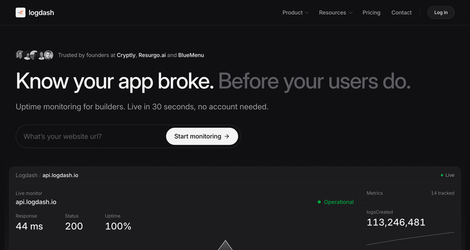
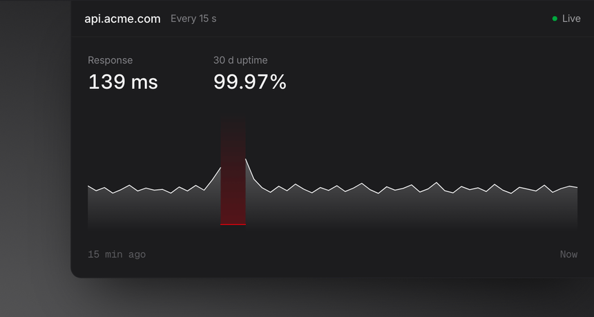
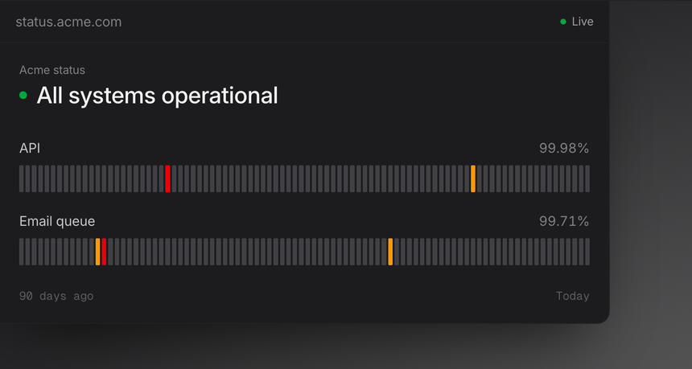
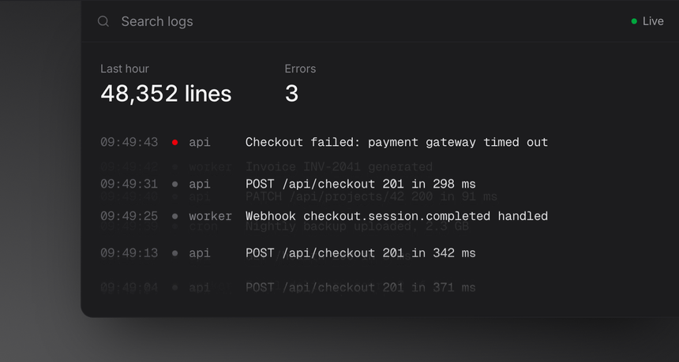
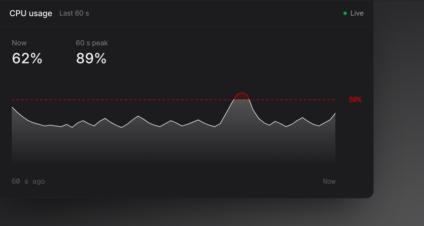
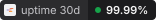
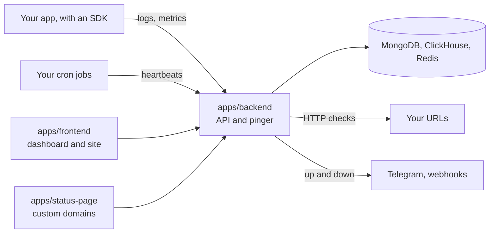

<p align="center">
  <a href="https://logdash.io">
    
  </a>
</p>

<h1 align="center">Logdash</h1>

<p align="center">
  <b>Know your app broke. Before your users do.</b>
  <br>
  Uptime monitoring, status pages, logs and metrics for builders.
  <br>
  Live in 30 seconds, no account needed.
</p>

<p align="center">
  <a href="./LICENSE"></a>
  <a href="https://github.com/logdash-io/logdash.io/stargazers"></a>
  <a href="https://discord.gg/naftPW4Hxe"></a>
  <a href="https://github.com/logdash-io/logdash.io/commits/main"></a>
  <a href="./CONTRIBUTING.md"></a>
</p>

<p align="center">
  <a href="https://logdash.io"><b>Try it</b></a> ·
  <a href="https://logdash.io/docs">Docs</a> ·
  <a href="https://discord.gg/naftPW4Hxe">Discord</a> ·
  <a href="https://insigh.to/b/logdash">Roadmap</a> ·
  <a href="https://logdash.io/d/685498e1e0ad21003cb3b2fa">Status</a> ·
  <a href="https://github.com/logdash-io/logdash.io/issues/new/choose">Report a bug</a>
</p>

<p align="center">
  <a href="https://logdash.io">
    
  </a>
  <br>
  <sub>Recorded on the real app with a real URL. The waits between checks are sped up.</sub>
</p>

## What it does

Logdash watches the thing you shipped and tells you when it stops working.
Paste a URL and checks start right away, with the status code and response time of every check kept.
When a monitor goes down or comes back, you get a Telegram message or a webhook.
The logs and metrics from the same service are already on the same page, as the evidence for what actually happened.

<table>
  <tr>
    <td valign="top" width="50%">
      <a href="https://logdash.io/features/monitoring"></a>
      <h3>Uptime monitoring</h3>
      <p>Checks every 15 seconds, 1 minute or 5 minutes, depending on the plan.
      When something stops answering, you hear about it before your users do.</p>
    </td>
    <td valign="top" width="50%">
      <a href="https://logdash.io/d/685498e1e0ad21003cb3b2fa"></a>
      <h3>Status pages</h3>
      <p>Uptime history your customers can check themselves, on your own domain.
      <a href="https://logdash.io/d/685498e1e0ad21003cb3b2fa">Ours is live</a>.</p>
    </td>
  </tr>
</table>

<table>
  <tr>
    <td valign="top" width="50%">
      <a href="https://logdash.io/features/logging"></a>
      <h3>Logs</h3>
      <p>Every service in one searchable tail.
      Filter by level and find the line that broke it.</p>
    </td>
    <td valign="top" width="50%">
      <a href="https://logdash.io/features/metrics"></a>
      <h3>Metrics</h3>
      <p>Sign-ups, payments, queue depth.
      Track what matters with one line of code, with nothing to host or maintain.</p>
    </td>
  </tr>
</table>

- **Cron and worker heartbeats.** A push monitor is a URL your job calls when it finishes. No call, no heartbeat, alert. A normal uptime check can never see that failure.
- **Alerts** go to Telegram and webhooks today. Slack, email and PagerDuty are not built yet.

## Uptime badges for your README

Every monitor on a published status page gets a badge.
The numbers come straight from the status page, so a badge can't round an outage away.

<p>
  
  &nbsp;
  <picture>
    <source media="(prefers-color-scheme: dark)" srcset=".github/assets/badges/status-dark.svg">
    
  </picture>
</p>

<p>
  <picture>
    <source media="(prefers-color-scheme: dark)" srcset=".github/assets/badges/card-dark.svg">
    
  </picture>
</p>

| Style     | What it shows                                                | Options                            |
| --------- | ------------------------------------------------------------ | ---------------------------------- |
| `classic` | Uptime over a period, sized to sit next to your other badges | `period=24h`, `7d`, `30d` or `90d` |
| `status`  | The monitor's name and its live state                        | `theme=light` or `dark`            |
| `card`    | Name, 90-day uptime and one bar per day                      | `theme=light` or `dark`            |

Publish a status page, open **README badges** in its settings, pick a style and copy the snippet.
A monitor's own settings have the same picker under **README badge**.

```md
[](https://logdash.io/d/<page-id>)
```

On plans with a custom domain, badges come from your own domain, like `status.acme.com/badges/<key>.svg`, without the Logdash mark.

## Getting started

### Cloud (recommended)

Go to [logdash.io](https://logdash.io), paste the URL you want watched, and press enter.
You get a monitor and a live dashboard without creating an account, because the app opens an anonymous workspace for you and only asks you to sign in when you want to keep it.

### Self-hosting

Everything that runs Logdash is in this repo under the AGPL-3.0 licence, and the whole stack comes up locally for development in a few commands (see below).
Production self-hosting is not there yet, and we would rather say that than sell you a `docker compose up` that falls over in a week.
There is no packaged deployment, no upgrade path between versions, and the boot path still constructs Stripe and Resend clients, so a real instance wants real keys or a patch.
Work on a supported self-host deployment is tracked in [the self-hosting issue](https://github.com/logdash-io/logdash.io/issues/251); tell us there or in [Discord](https://discord.gg/naftPW4Hxe) if you need it, because that is what moves it up the list.

To run it on your machine, see [Developing locally](#developing-locally) and [`CONTRIBUTING.md`](./CONTRIBUTING.md#running-locally).

## Sending data

Eight SDKs, one API key per project.

| Language | Install                                       | Repo                                                              |
| -------- | --------------------------------------------- | ----------------------------------------------------------------- |
| Node.js  | `npm install @logdash/node`                   | [logdash-io/node-sdk](https://github.com/logdash-io/node-sdk)     |
| Python   | `pip install logdash`                         | [logdash-io/python-sdk](https://github.com/logdash-io/python-sdk) |
| Go       | `go get github.com/logdash-io/go-sdk/logdash` | [logdash-io/go-sdk](https://github.com/logdash-io/go-sdk)         |
| .NET     | `dotnet add package Logdash`                  | [logdash-io/dotnet-sdk](https://github.com/logdash-io/dotnet-sdk) |
| Java     | `io.logdash:logdash:0.2.0`                    | [logdash-io/java-sdk](https://github.com/logdash-io/java-sdk)     |
| Rust     | `cargo add logdash`                           | [logdash-io/rust-sdk](https://github.com/logdash-io/rust-sdk)     |
| Ruby     | `gem install logdash`                         | [logdash-io/ruby-sdk](https://github.com/logdash-io/ruby-sdk)     |
| PHP      | `composer require logdash/php-sdk`            | [logdash-io/php-sdk](https://github.com/logdash-io/php-sdk)       |

The SDKs are convenience wrappers.
The wire protocol is three HTTP endpoints on `https://api.logdash.io`, and nothing stops you from calling them directly.

| Endpoint                 | What it does               | Auth                     |
| ------------------------ | -------------------------- | ------------------------ |
| `POST /logs`             | ship one log line          | `project-api-key` header |
| `PUT /metrics`           | `set` or `mutate` a metric | `project-api-key` header |
| `POST /ping/<monitorId>` | heartbeat a cron or worker | none, and no body        |

```bash
curl -X POST "https://api.logdash.io/logs" \
  -H "project-api-key: <your-project-api-key>" \
  -H "Content-Type: application/json" \
  -d '{"message": "Application started successfully", "level": "info",
       "createdAt": "2026-09-04T09:12:33.000Z", "sequenceNumber": 0}'
```

The heartbeat endpoint is deliberately public and takes no body, so a cron job can be one line: `curl -fsS -X POST https://api.logdash.io/ping/<monitorId>`.

## How it fits together



| Path                | What it is                                                         |
| ------------------- | ------------------------------------------------------------------ |
| `apps/frontend`     | SvelteKit app and marketing site, deployed on Cloudflare Workers    |
| `apps/backend`      | NestJS API, with MongoDB, Redis and ClickHouse                      |
| `apps/status-page`  | Renderer for status pages served on customer custom domains         |
| `packages/hyper-ui` | Shared Svelte 5 component library and Tailwind theme                |

pnpm workspaces, `apps/*` and `packages/*`, pinned to pnpm 10.7.0 in the root `package.json`.

## Developing locally

Prerequisites: Node 22 (there is an `.nvmrc`), pnpm 10.7.0 via `corepack enable`, and Docker for MongoDB, Redis and ClickHouse.

```bash
nvm use && pnpm install
cp apps/backend/.env.example apps/backend/.env && cp apps/frontend/.env.example apps/frontend/.env
docker compose -f docker-compose.dev.yml up -d --wait
pnpm --filter backend migrate-up && pnpm --filter backend migrate-clickhouse
```

Then run the two apps in separate terminals.

```bash
pnpm dev:backend    # API on http://localhost:3000
pnpm dev:frontend   # app on http://localhost:5173
```

The backend reads `apps/backend/.env` at import time and refuses to boot without `OUR_ENV` and a reachable Mongo, Redis and ClickHouse.
The example file ships working placeholders for all of them.
The frontend example points at the production API, so you can work on the UI without running a backend at all.
[`CONTRIBUTING.md`](./CONTRIBUTING.md#running-locally) has the full environment reference, the OAuth setup, the migration details and how to run the test suite.

## Contributing

Pick something up:

- [good first issue](https://github.com/logdash-io/logdash.io/issues?q=is%3Aissue+is%3Aopen+label%3A%22good+first+issue%22)
- [help wanted](https://github.com/logdash-io/logdash.io/issues?q=is%3Aissue+is%3Aopen+label%3A%22help+wanted%22)
- [feature requests and voting](https://insigh.to/b/logdash)

Read [`CONTRIBUTING.md`](./CONTRIBUTING.md) before you open a PR, and come say hello in [Discord](https://discord.gg/naftPW4Hxe) if you want to talk something through first.

<a href="https://github.com/logdash-io/logdash.io/graphs/contributors">
  
</a>

## Security

Please do not open a public issue for a vulnerability.
[`SECURITY.md`](./SECURITY.md) has the disclosure process and where to send it.

## License

AGPL-3.0. See [`LICENSE`](./LICENSE).
Copyright (c) 2025 Aleksander Błaszkiewicz and Szymon Grącki.
You can run, change and self-host Logdash for anything, including commercial use.
If you run a modified version as a service for others, you have to publish your changes under the same licence.
`packages/hyper-ui` stays MIT, see [`packages/hyper-ui/LICENSE`](./packages/hyper-ui/LICENSE).

The hosted product at [logdash.io](https://logdash.io) runs this code with billing wired up and plan limits enforced.
There is no `ee/` directory, no dual licence and no feature in this repo that is gated behind a paid key.
