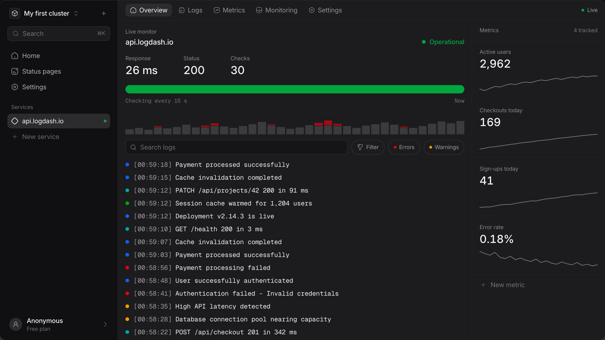

<p align="center">
  
</p>

<h1 align="center">Logdash</h1>

<p align="center">
  <a href="./LICENSE"></a>
  <a href="https://github.com/logdash-io/logdash.io"></a>
  <a href="https://discord.gg/naftPW4Hxe"></a>
  <a href="https://github.com/logdash-io/logdash.io/commits/main"></a>
  <a href="./CONTRIBUTING.md"></a>
</p>

<p align="center">
  <a href="https://logdash.io">Website</a> -
  <a href="https://logdash.io/docs">Docs</a> -
  <a href="https://discord.gg/naftPW4Hxe">Community</a> -
  <a href="https://insigh.to/b/logdash">Roadmap</a> -
  <a href="https://logdash.io/d/685498e1e0ad21003cb3b2fa">Status</a> -
  <a href="https://github.com/logdash-io/logdash.io/issues/new/choose">Bug reports</a>
</p>

<p align="center">
  
</p>

## Logdash tells you your service is down before your users do

Logdash watches the thing you shipped and tells you when it stops working.
HTTP monitors check your endpoints every 15 seconds and record the status code and the response time on every check.
Push monitors do the same job in reverse: your cron or background worker sends a heartbeat, and when the heartbeat stops arriving Logdash notices, which is the failure mode a normal uptime check can never see.
When a monitor flips up or down you get a Telegram message or a webhook.
Then the logs and the metrics you shipped from the same service are already there, on the same page, as the evidence for what actually happened.

- **[Uptime monitoring](https://logdash.io/features/monitoring)** - HTTP checks on a 15 second, 1 minute or 5 minute schedule, storing the status code and the response time of every single check.
- **[Cron and worker heartbeats](https://logdash.io/guides/monitoring)** - a push monitor is a URL your job hits when it finishes. No hit, no heartbeat, alert.
- **Telegram and webhook alerts** - fired on every up/down transition. Those two are the whole list today. Slack, email and PagerDuty are not built.
- **[Metrics](https://logdash.io/features/metrics)** - `set` an absolute value or `mutate` a counter from any SDK, then chart it next to your uptime.
- **[Logs](https://logdash.io/features/logging)** - structured log ingest with levels, search and an error/warning histogram over the tail.
- **[Public status pages](https://logdash.io/d/685498e1e0ad21003cb3b2fa)** - point a custom domain at one. That link is ours, live in production.

## Getting started

### Cloud (recommended)

Go to [logdash.io](https://logdash.io), paste the URL you want watched, and press enter.
You get a monitor and a live dashboard without creating an account, because the app opens an anonymous workspace for you and only asks you to sign in when you want to keep it.

### Self-hosting

Everything that runs Logdash is in this repo under the MIT licence, and the whole stack comes up locally for development in a few commands (see below).
Production self-hosting is not there yet, and we would rather say that than sell you a `docker compose up` that falls over in a week.
There is no packaged deployment, no upgrade path between versions, and the boot path still constructs Stripe and Resend clients, so a real instance wants real keys or a patch.
Work on a supported self-host deployment is tracked in [the self-hosting issue](https://github.com/logdash-io/logdash.io/issues/251); tell us there or in [Discord](https://discord.gg/naftPW4Hxe) if you need it, because that is what moves it up the list.

To run it on your machine, see [Developing locally](#developing-locally) and [`CONTRIBUTING.md`](./CONTRIBUTING.md#running-locally).

## Sending data

Eight SDKs, one API key per project.

| Language | Install                                       | Repo                                                              |
| -------- | --------------------------------------------- | ----------------------------------------------------------------- |
| Node.js  | `npm install @logdash/node`                   | [logdash-io/node-sdk](https://github.com/logdash-io/node-sdk)     |
| Python   | `pip install logdash`                         | [logdash-io/python-sdk](https://github.com/logdash-io/python-sdk) |
| Go       | `go get github.com/logdash-io/go-sdk/logdash` | [logdash-io/go-sdk](https://github.com/logdash-io/go-sdk)         |
| .NET     | `dotnet add package Logdash`                  | [logdash-io/dotnet-sdk](https://github.com/logdash-io/dotnet-sdk) |
| Java     | `io.logdash:logdash:0.2.0`                    | [logdash-io/java-sdk](https://github.com/logdash-io/java-sdk)     |
| Rust     | `cargo add logdash`                           | [logdash-io/rust-sdk](https://github.com/logdash-io/rust-sdk)     |
| Ruby     | `gem install logdash`                         | [logdash-io/ruby-sdk](https://github.com/logdash-io/ruby-sdk)     |
| PHP      | `composer require logdash/php-sdk`            | [logdash-io/php-sdk](https://github.com/logdash-io/php-sdk)       |

The SDKs are convenience wrappers.
The wire protocol is three HTTP endpoints, and nothing stops you from calling them directly.

| Endpoint                                       | What it does               | Auth                     |
| ---------------------------------------------- | -------------------------- | ------------------------ |
| `POST https://api.logdash.io/logs`             | ship one log line          | `project-api-key` header |
| `PUT https://api.logdash.io/metrics`           | `set` or `mutate` a metric | `project-api-key` header |
| `POST https://api.logdash.io/ping/<monitorId>` | heartbeat a cron or worker | none, and no body        |

```bash
curl -X POST "https://api.logdash.io/logs" \
  -H "project-api-key: <your-project-api-key>" \
  -H "Content-Type: application/json" \
  -d '{"message": "Application started successfully", "level": "info", "createdAt": "2026-09-04T09:12:33.000Z", "sequenceNumber": 0}'
```

The heartbeat endpoint is deliberately public and takes no body, so a cron job can be one line: `curl -fsS -X POST https://api.logdash.io/ping/<monitorId>`.

## Repository layout

```
apps/frontend      SvelteKit app and marketing site, deployed on Cloudflare Workers
apps/backend       NestJS API - MongoDB, Redis and ClickHouse
apps/status-page   Renderer for status pages served on customer custom domains
packages/hyper-ui  Shared Svelte 5 component library and Tailwind theme
```

pnpm workspaces, `apps/*` and `packages/*`, pinned to pnpm 10.7.0 in the root `package.json`.

## Developing locally

Prerequisites: Node 22 (there is an `.nvmrc`), pnpm 10.7.0 via `corepack enable`, and Docker for MongoDB, Redis and ClickHouse.

```bash
nvm use && pnpm install
cp apps/backend/.env.example apps/backend/.env && cp apps/frontend/.env.example apps/frontend/.env
docker compose -f docker-compose.dev.yml up -d --wait
pnpm --filter backend migrate-up && pnpm --filter backend migrate-clickhouse
```

Then run the two apps in separate terminals.

```bash
pnpm dev:backend   # API on http://localhost:3000
pnpm dev:frontend                        # app on http://localhost:5173
```

The backend reads `apps/backend/.env` at import time and refuses to boot without `OUR_ENV` and a reachable Mongo, Redis and ClickHouse.
The example file ships working placeholders for all of them.
The frontend example points at the production API, so you can work on the UI without running a backend at all.
[`CONTRIBUTING.md`](./CONTRIBUTING.md#running-locally) has the full environment reference, the OAuth setup, the migration details and how to run the test suite.

## Contributing

Pick something up:

- [good first issue](https://github.com/logdash-io/logdash.io/issues?q=is%3Aissue+is%3Aopen+label%3A%22good+first+issue%22)
- [help wanted](https://github.com/logdash-io/logdash.io/issues?q=is%3Aissue+is%3Aopen+label%3A%22help+wanted%22)
- [feature requests and voting](https://insigh.to/b/logdash)

Read [`CONTRIBUTING.md`](./CONTRIBUTING.md) before you open a PR, and come say hello in [Discord](https://discord.gg/naftPW4Hxe) if you want to talk something through first.

## Security

Please do not open a public issue for a vulnerability.
[`SECURITY.md`](./SECURITY.md) has the disclosure process and where to send it.

## License

MIT. See [`LICENSE`](./LICENSE).

The hosted product at [logdash.io](https://logdash.io) runs this code with billing wired up and plan limits enforced.
There is no `ee/` directory, no dual licence and no feature in this repo that is gated behind a paid key.
